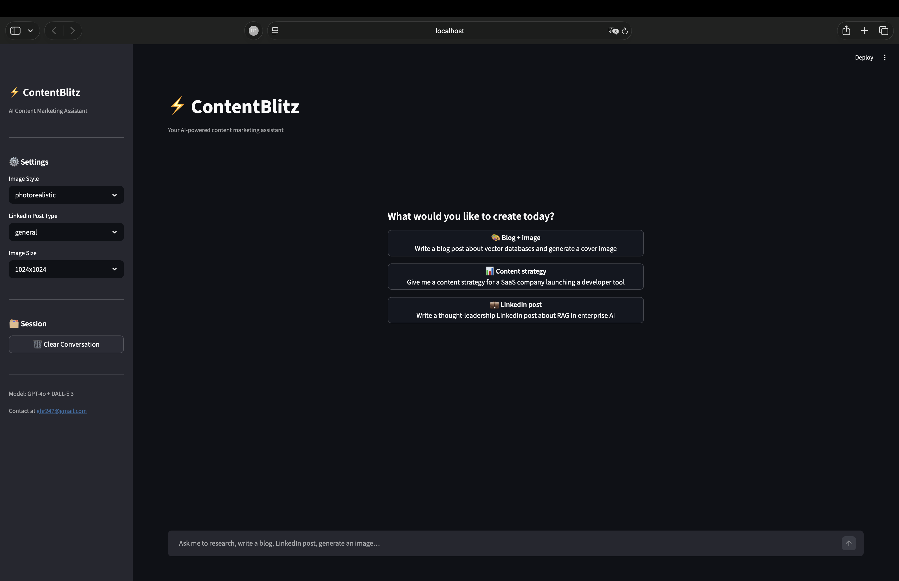
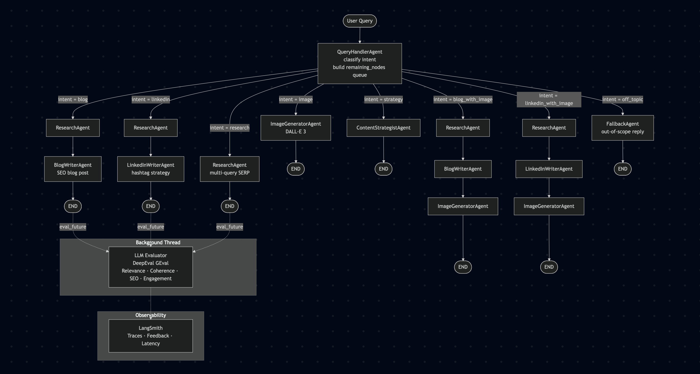
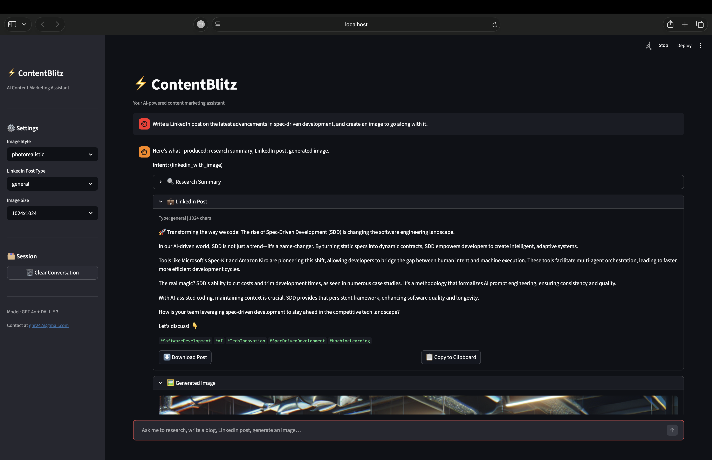
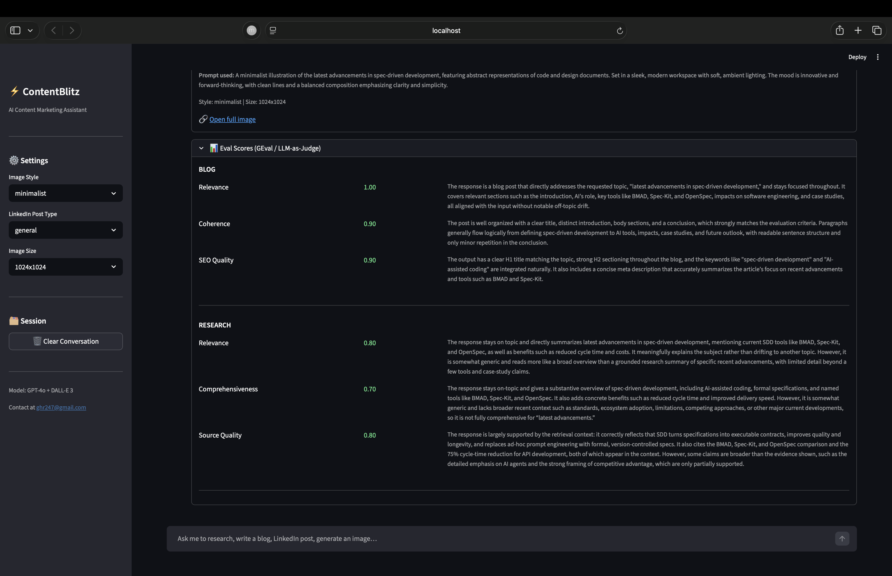
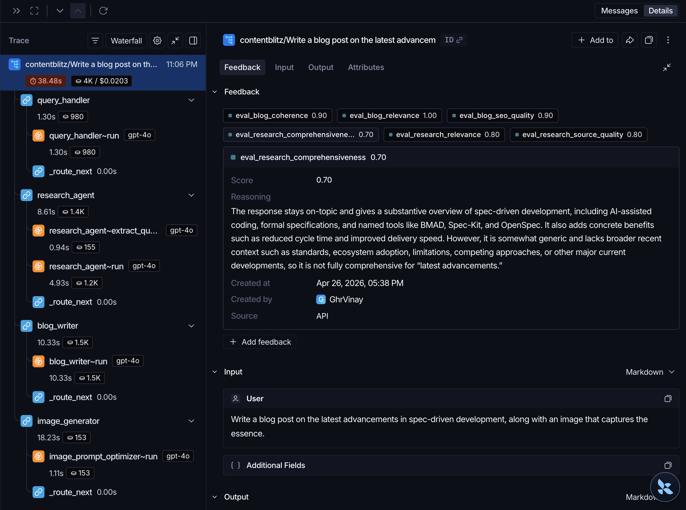

# ContentBlitz — AI Content Marketing Assistant
_Available at_: https://github.com/ghr-vinay/content-blitz

> A **production-grade, multi-agent AI system** that generates SEO blog posts, LinkedIn posts, web research summaries, content strategies, and AI images — all from a single natural-language prompt.


<!-- PLACEHOLDER: replace with actual screenshot of the Streamlit chat UI -->

---

## Table of Contents

1. [What is ContentBlitz?](#what-is-contentblitz)
2. [Important: Scope & Intended Use](#important-scope--intended-use)
3. [Features](#features)
4. [Architecture](#architecture)
5. [Tech Stack](#tech-stack)
6. [Project Structure](#project-structure)
7. [Setup & Running](#setup--running)
8. [Configuration](#configuration)
9. [Environment Variables](#environment-variables)
10. [Evaluation (LLM-as-Judge)](#evaluation-llm-as-judge)
11. [Running Tests](#running-tests)

---

## What is ContentBlitz?

ContentBlitz is an AI-powered content marketing assistant built on a **LangGraph multi-agent pipeline**. You describe what you need in plain English — a blog post, a LinkedIn update, a topic deep-dive — and the system automatically routes your request through the right sequence of specialised agents, each with a single, well-defined responsibility.

It is designed for **content marketers, developers, and teams** who want AI-generated, high-quality content with automatic quality evaluation baked in — not a generic chatbot.

---

## Important: Scope & Intended Use

> **ContentBlitz is not a free-flowing conversational chatbot.**

It is purpose-built to handle a specific, narrow set of content marketing tasks:

| ✅ Supported | ❌ Not supported |
|---|---|
| Generate a blog post on a topic | General Q&A or open-ended chat |
| Write a LinkedIn post | Code generation or debugging |
| Research a topic via web search | Customer support conversations |
| Generate an image with DALL-E 3 | Translation or document summarisation |
| Create a content strategy | Anything outside content marketing |

Off-topic requests are handled gracefully by a **FallbackAgent** that explains the system's scope rather than hallucinating an answer.

---

## Features

- 📝 **Blog post generation** — SEO-optimised output with title, meta description, keyword list, and structured headings
- 💼 **LinkedIn post generation** — Engagement-optimised content with hashtag strategy; supports post styles: `thought-leadership`, `announcement`, `story`, `listicle`, `general`
- 🔍 **Deep web research** — Multi-query SERP search with requirement-aware synthesis; results grounded in real sources
- 🗺️ **Content strategy** — Structured strategy output for a given topic or campaign goal
- 🎨 **AI image generation** — DALL-E 3 integration with configurable style and size
- 🔗 **Combined intents** — Request blog + image or LinkedIn + image in a single prompt; the agent pipeline chains automatically
- 🔄 **Multi-turn refinement** — Follow up with "make it shorter", "add more statistics", or "change the tone" and the relevant agent updates its prior output
- 📊 **Automatic LLM evaluation** — Every response is scored in the background using DeepEval GEval (Relevance, Coherence, SEO Quality, Engagement Quality, Source Quality). Scores appear in the UI without blocking the response
- 🚧 **Off-topic fallback** — Unrecognised requests are gracefully declined with an explanation

---

## Architecture

### LangGraph Flow

The system uses a **generalised queue-based routing** pattern. The `QueryHandlerAgent` classifies intent and populates a `remaining_nodes` queue (e.g. `["research_agent", "blog_writer"]`). Each node pops itself from the queue; a single `_route_next` function reads the next head to determine the next edge.



> _**Note on conditional edges**_:   
Every node shares a single `_route_next` function. Routing is data-driven — adding a new intent is as simple as defining a new key (intent name) → value (array of nodes) mapping in `_INTENT_TO_NODE` dictionary. No additional graph edges need to be declared.

---

## Tech Stack

| Layer | Technology | Role |
|---|---|---|
| Agent orchestration | [LangGraph](https://github.com/langchain-ai/langgraph) | Stateful multi-agent graph with conditional edges |
| LLM | GPT-4o via [LangChain ChatOpenAI](https://python.langchain.com/docs/integrations/chat/openai/) | Text generation for all agents |
| Web search | [SerpAPI](https://serpapi.com/) | Multi-query real-time web research |
| Image generation | DALL-E 3 (OpenAI) | AI image creation |
| LLM evaluation | [DeepEval GEval](https://docs.confident-ai.com/docs/metrics-llm-evals) | LLM-as-Judge quality scoring |
| Observability | [LangSmith](https://smith.langchain.com/) | Trace logging, feedback, latency tracking |
| Web UI | [Streamlit](https://streamlit.io/) | Chat-style interface with live eval scores |
| Config | YAML + python-dotenv | Environment-aware configuration |
| Data validation | Pydantic v2 | Typed agent input/output contracts |
| Resilience | Tenacity | Exponential backoff on LLM/API calls |
| Testing | pytest | Unit, integration, and E2E test suites |

---

## Project Structure

The codebase follows **SOLID principles** throughout — every agent, client, and module has a single responsibility and depends on abstractions rather than concrete implementations. This makes the system modular, easy to test, and straightforward to extend.

```
content-blitz/
│
├── src/
│   ├── agents/              # One file per agent (SRP)
│   │   ├── base_agent.py    #   Abstract base — all agents implement .run(state)
│   │   ├── query_handler.py #   Intent classification + routing queue init
│   │   ├── research_agent.py#   Multi-query SERP + LLM synthesis
│   │   ├── blog_writer.py   #   SEO blog post generation
│   │   ├── linkedin_writer.py#  LinkedIn post + hashtag strategy
│   │   ├── image_generator.py#  DALL-E 3 image generation
│   │   ├── content_strategist.py
│   │   └── fallback_agent.py#   Off-topic / out-of-scope handling
│   │
│   ├── core/
│   │   ├── config.py        # Singleton config loader (YAML + env)
│   │   ├── models.py        # Shared Pydantic models (AgentState, BlogPost, …)
│   │   ├── router.py        # DI container — wires agents with concrete clients
│   │   └── workflow.py      # Public API: run() / run_non_blocking_eval()
│   │
│   ├── integrations/        # External service clients (all behind abstractions)
│   │   ├── base_tool.py     #   BaseLLMClient interface
│   │   ├── openai_client.py #   ChatOpenAI implementation with retry
│   │   ├── serp_client.py   #   SerpAPI wrapper
│   │   └── image_clients.py #   DALL-E 3 client
│   │
│   ├── workflow/
│   │   ├── langgraph_workflow.py  # Graph definition, nodes, _route_next
│   │   └── state_management.py   # GraphState TypedDict
│   │
│   ├── eval/
│   │   └── llm_eval.py      # DeepEval GEval metrics per content type
│   │
│   ├── web_app/
│   │   └── streamlit_app.py # Streamlit chat UI with background eval polling
│   │
│   └── cli_app.py           # CLI entrypoint
│
├── tests/
│   ├── unit/                # Fast, mocked — no API calls
│   ├── integration/         # Full agent pipeline, mocked LLM
│   └── e2e/                 # Full graph run, stubbed external I/O
│
├── config/
│   └── services.yaml        # LLM model, eval settings, search config
│
├── conftest.py              # pytest root config
└── requirements.txt
```

---

## Setup & Running

### Prerequisites

- Python 3.11+
- API keys for OpenAI and SerpAPI (LangSmith is optional but recommended)

### 1. Clone the repository

```bash
git clone https://github.com/your-org/content-blitz.git
cd content-blitz
```

### 2. Create a virtual environment

```bash
python -m venv .venv
source .venv/bin/activate        # macOS / Linux
# .venv\Scripts\activate         # Windows
```

### 3. Install dependencies

```bash
pip install -r requirements.txt
```

### 4. Configure environment variables

Create a `.env` file in the project root and populate it with your API keys:

```bash
touch .env
# Open .env and add your keys — see the Environment Variables section for the full list
```

### 5. Run the Streamlit web UI

```bash
streamlit run src/web_app/streamlit_app.py
```

Open [http://localhost:8501](http://localhost:8501) in your browser.

<p align="center">
  
</p>

### 6. Run the CLI _(Same functionality without UI)_

```bash
python -m src.cli_app
```

---

## Configuration

Edit `config/services.yaml` to tune the system without touching code:

```yaml
llm:
  model: gpt-4o          # any OpenAI model name
  temperature: 0.7
  max_tokens: 4096

search:
  num_results: 5         # number of SERP results per query

image:
  size: "1024x1024"      # 1024x1024 | 1792x1024 | 1024x1792
  quality: standard      # standard | hd

eval:
  enabled: true          # set to false to skip evaluation entirely
  model: gpt-5.2-mini    # judge model (cheaper model works well here)
  threshold: 0.5         # scores above this are marked as "passed"
```

---

## Environment Variables

Create a `.env` file in the project root with the following keys:

| Variable | Required | Description |
|---|---|---|
| `OPENAI_API_KEY` | ✅ Yes | OpenAI API key (LLM + DALL-E 3) |
| `SERP_API_KEY` | ✅ Yes | SerpAPI key for web research |
| `LANGSMITH_API_KEY` | ⬜ Optional | LangSmith tracing (traces disabled if absent) |

```env
OPENAI_API_KEY=sk-...
SERP_API_KEY=...
LANGSMITH_API_KEY=lsv2_...   # optional but recommended
```

> LangSmith traces are sent to a project named `contentblitz` by default. Change this in `config/services.yaml` under `langsmith.project`.

---

## Evaluation (LLM-as-Judge)

After every response, ContentBlitz runs **DeepEval GEval** metrics in a background thread — the content is returned to you immediately while scoring happens in parallel.

Scores appear below the relevant content block in the UI once ready.

<p align="center">
  
</p>

### Metrics by content type

| Content type | Metrics |
|---|---|
| Blog post | Relevance, Coherence, SEO Quality |
| LinkedIn post | Relevance, Engagement Quality, Conciseness |
| Research | Relevance, Comprehensiveness, Source Quality |

Each metric scores 0.0–1.0. A score ≥ the configured `threshold` (default `0.5`) is marked **passed**.

> **Note**: Scores are also logged to **LangSmith** as feedback on the parent trace, enabling regression tracking across runs.

<p align="center">
  
</p>

---

## Running Tests

```bash
# Unit tests only (fast, no API calls)
pytest tests/unit/ -v

# Unit + integration tests
pytest tests/unit/ tests/integration/ -v

# Full suite including E2E (stubs external I/O, still no real API calls)
pytest tests/ -v
```

---

## Usage Examples

Type any of these prompts directly into the Streamlit chat (or CLI) to get started:

### Research only
```
Research the latest developments in AI agents in 2025
```
> Returns a structured summary with key findings and cited sources.

### Blog post
```
Write a blog post about the rise of RAG in enterprise AI
```
> Researches the topic first, then produces an SEO-optimised blog post with title, meta description, keywords, and headers.

### LinkedIn post
```
Write a thought-leadership LinkedIn post about vector databases
```
> Generates an engagement-optimised post with hashtag strategy. Change the post type in the sidebar (thought-leadership, story, listicle, etc.).

### Blog post + cover image
```
Write a blog post about multi-agent AI systems and generate a cover image for it
```
> Chains three agents: Research → Blog Writer → Image Generator. The image prompt is automatically derived from the blog topic.

### LinkedIn post + image
```
Write a LinkedIn announcement post about our new AI product launch and generate an image
```

### Content strategy
```
Give me a content strategy for a SaaS company launching a new developer tool
```

### Multi-turn refinement
After generating any content, follow up in the same session:
```
Make it shorter and add a stronger call-to-action
```
```
Add two real-world examples to the blog post
```
```
Change the tone to be more conversational
```
> The agent detects you are refining prior output and patches it rather than regenerating from scratch.

### Off-topic (handled gracefully)
```
How can I make Matcha at home?
```
> ContentBlitz recognises this is out of scope and responds with a polite redirect — no hallucinated content.

---

## Troubleshooting

### 1. `ValueError: OPENAI_API_KEY is not set`
You haven't created or populated your `.env` file. Create it manually in the project root:
```bash
touch .env
# Open .env and add your actual keys — see the Environment Variables section
```

### 2. `streamlit: command not found` / `python: command not found`
Your virtual environment is not activated.
```bash
source .venv/bin/activate   # macOS / Linux
```

### 3. SERP results are empty or quota errors appear
1. Check your `SERP_API_KEY` is correct in `.env`
2. Verify your SerpAPI plan has remaining credits at [serpapi.com/dashboard](https://serpapi.com/dashboard)
3. The system will still generate content using the LLM alone if SERP returns no results

### 4. Eval scores never appear in the UI
1. **Eval is disabled** — check `config/services.yaml`: `eval.enabled` must be `true`
2. **Judge model is wrong** — `eval.model` must be a valid OpenAI model name (e.g. `gpt-4o-mini`). An invalid model name causes the background eval thread to silently fail.

### 5. LangSmith traces not showing up
1. `LANGSMITH_API_KEY` is missing from `.env` — tracing is silently skipped when the key is absent
2. Confirm the key is valid at [smith.langchain.com](https://smith.langchain.com) and look for the `contentblitz` project

### 6. The graph produces no output (blank response)
1. Run with the CLI (`python -m src.cli_app`) to see raw error output without Streamlit swallowing it
2. Check the terminal where Streamlit is running for stack traces
3. Ensure all required keys are set — a missing `OPENAI_API_KEY` causes every agent to fail silently in the graph

